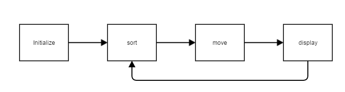
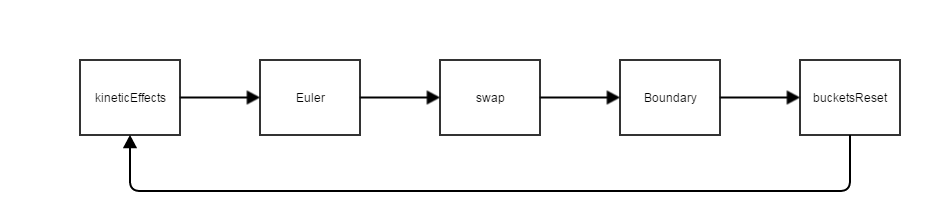

cuSPH
======================
Simple library for the SPH simulation and display in CUDA.

Currently available on 3D SPH.

Requirements
------
+   CUDA 6.5 or later.
+   GLFW 3.

Usage
------
### Basic workflow ###



+   Initialize :
    Set the number of particles, the time step and etc.
    ***The number of particles should be a multiple of 512.***

    ``Box`` contains the max boundary in x/y/z axis and the minimum radius of particles.
    ***The min boundary in each axis is fixed to 0.***

    Initialize the display system by ``displayCreate(std::string title)``.

+   ``sort`` :
    Sort particles by Bucket Sort.

+   ``move`` :
    Calculate and update the dynamics of particles.

+   ``display`` :
    Display particles by ``displayFunc()``.

```cpp
int main(void)
{
	struct licht::Box box;
	box.x = 10.0, box.y = 10.0, box.z = 10.0, box.rmin = 0.1;

	licht::cuSPH3D::cuSPH3D sph3d(10240, 0.001, box);
	sph3d.displayCreate(std::string("sph3d"));
	sph3d.pInit();
	//sph3d.sort();
	for(unsigned long long int t=1LLU; t<=1000000LLU; t++){
		sph3d.sort();
		sph3d.move();
		sph3d.display();
	}
}
```

### Simulation class setup ###
Create a simulation class from the base class ``template<class A, class B, unsigned int X, unsigned int Y, unsigned int Z> class cuSPH3DBase``.

The template parameters ``<class A, class B, unsigned int X, unsigned int Y, unsigned int Z>`` mean

+   `A` :
    The particle class. Use ``Particle3DBase`` or an extended class of it.

+   `B` :
    The temporal particle class. Use ``Particle3DTmpBase`` or an extended class of it.

+   `X` :
    The partition size of X axis in Bucket Sort.

+   `Y` :
    The partition size of Y axis in Bucket Sort.

+   `Z` :
    The partition size of Z axis in Bucket Sort.

***X/Y/Z should be a multiple of 8.***

Parameters of the constructor ``cuSPH3DBase(unsigned int n, double time_int, struct Box box)`` mean

+   `n` :
    The number of particles. ***This should be a multiple of 512.***

+   `time_int` :
    The time step in each calculation.

+   `box` :
    This contains the max boundary in x/y/z axis and the minimum radius of particles.

Then, override ``displayFunc()`` in order to display.

You can get/set the data of particles from/to CUDA device by ``particles.getFromDevice()``/``particles.setToDevice()``.

```cpp
struct Particle : public Particle3DBase{ };
struct ParticleTmp : public Particle3DTmpBase{ };

class cuSPH3D
	: public cuSPH3DBase<struct Particle, struct ParticleTmp,16U,16U,16U>
{
	private:
		SolidSphere sphere;//Sphere to display
	public:
		cuSPH3D(unsigned int n, double time_int, struct Box box)
			: cuSPH3DBase(n, time_int, box), sphere(0.1,10,10)
		{
		}
		~cuSPH3D()
		{ }

		virtual void displayFunc()
		{
			//Get from CUDA device
			auto& p = particles.getFromDevice();
			for(int i=0; i<particles.size; i++)
			{
				auto x = p[i].p.x,
				     y = p[i].p.y,
				     z = p[i].p.z;
				std::vector<GLfloat> color = {0.0,1.0,0,1.0};
				sphere.draw(x,y,z,color);
			}
		}

		//Particle initializer
		void pInit()
		{
			auto& p = particles.getHostPtr();
			auto size = particles.size;

			for(int i=0; i<size; i++)
			{
				//Position
				p[i].p.x = 10.0*static_cast<double>(rand())/static_cast<double>(RAND_MAX);
				p[i].p.y = 10.0*static_cast<double>(rand())/static_cast<double>(RAND_MAX);
				p[i].p.z = 10.0*static_cast<double>(rand())/static_cast<double>(RAND_MAX);
				//Velocity
				p[i].v.x = 0;
				p[i].v.y = 10;
				p[i].v.z = 0;

				//Radius
				p[i].r = 0.1;
				//Mass
				p[i].m = 0.01;
			}
			//Set to CUDA device
			particles.setToDevice();
		}

		...
}
```

### Override calculation functions ###



``move`` calls these functions.

+   ``kineticEffects`` :
    Set kinetic effects on each particle into its member ``f``.

+   ``Euler`` :
    Calculate the particle dynamics and set the data into the temporal particle array.

+   ``swap`` :
    Set the calculated data into particles.

+   ``Boundary`` :
    Deal with the boundary condition.

+   ``bucketsReset`` :
    Reset buckets.

You need to override ``kineticEffects``, ``swap`` and ``Boundary``.

##### 1. Kinetic effect function #####
Override the kinetic effect function `` kineticEffects(A* p, B* tmp, struct Bucket (*buckets_d)[X][Y], struct Box* box_d)`` in each particle.

This library automatically calculate the particle movement by storing kinetic effects into the member ``f`` of each particle.

+   `p` :
    The particle array.

+   `tmp` :
    The temporal particle array.

+   `(*buckets_d)[X][Y]` :
    The Bucket Sort array.

    A bucket contains particles which center position are in itself.

    The member ``bucket_loc`` of the particle class points its location in buckets.

    You can find neighbour particles by searching neighbour backets.

+   `box_d` :
    It contains max boundary of x/y/z axis and the minimum radius of particles.

```cpp
namespace licht
{
	namespace cuSPH3D
	{
		...

		template <class A, class B, unsigned int X, unsigned int Y, unsigned int Z>
			__global__ void kineticEffects(A* p, B* tmp, struct Bucket (*buckets_d)[X][Y], struct Box* box_d)
			{
				const unsigned int id = threadIdx.x + blockIdx.x * blockDim.x;

				auto& particle = p[id];
				auto& particle_tmp = tmp[id];

				//Store kinetic effects into the member "f"
				particle.f.x = - 0.01*particle.v.x;
				particle.f.y = - 0.01*particle.v.y;
				particle.f.z = -9.8*particle.m - 0.01*particle.v.z;

				//Max boundary of the simulation field.
				double xmax = box_d->x;
				double ymax = box_d->y;
				double zmax = box_d->z;

				//The Bucket location in which the particle exists.
				auto xloc = particle.bucket_loc.x;
				auto yloc = particle.bucket_loc.y;
				auto zloc = particle.bucket_loc.z;

				//Get the Bucket reference in which the particle exists.
				auto& bucket = buckets_d[xloc][yloc][zloc];
				for(int i=0; i<bucket.count; i++)
				{
					//Avoid the interaction calculation between itself and itself.
					if(i==particle.bucket_loc.no)
					{
						continue;
					}

					auto& particle_near = p[bucket.list[i]];
					double d = dist(particle.p, particle_near.p);
					double R = particle.r+particle_near.r;
					if(d<R)
					{
						auto v = particle.p-particle_near.p;
						particle.f
							= ( (100*pow(d-R, 2.0))*v )/abs(v);
					}
				}

				...

			}

		...
	}
}
```

##### 2. Swap function #####
Override the data swap function ``swap(A* p, B* tmp)``.

This is called after each calculation in order to update the data of particles ``A`` from temporal particles ``B``.
```cpp
template <class A, class B>
	__global__ void swap(A* p, B* tmp)
	{
		const unsigned int id = threadIdx.x + blockIdx.x * blockDim.x;

		auto& particle = p[id];
		auto& particle_tmp = tmp[id];

		particle.p = particle_tmp.p;
		particle.v = particle_tmp.v;
	}
```

##### 3. Boundary control function #####
Override the boundary control function ``boundary(A* p, struct Box* box_d)``.

You can set the boundary condition like a periodic boundary condition.

This is called after ``swap`` function called.

```cpp
template <class A, unsigned int X, unsigned int Y, unsigned int Z>
	__global__ void boundary(A* p, struct Box* box_d)
	{
	}
```

### Compile ###
	nvcc -std=c++11 cuSPH-test.cu

License
----------
Copyright &copy; 2015 cuSPH
Distributed under the [MIT License][mit].

[Apache]: http://www.apache.org/licenses/LICENSE-2.0
[MIT]: http://www.opensource.org/licenses/mit-license.php
[GPL]: http://www.gnu.org/licenses/gpl.html
